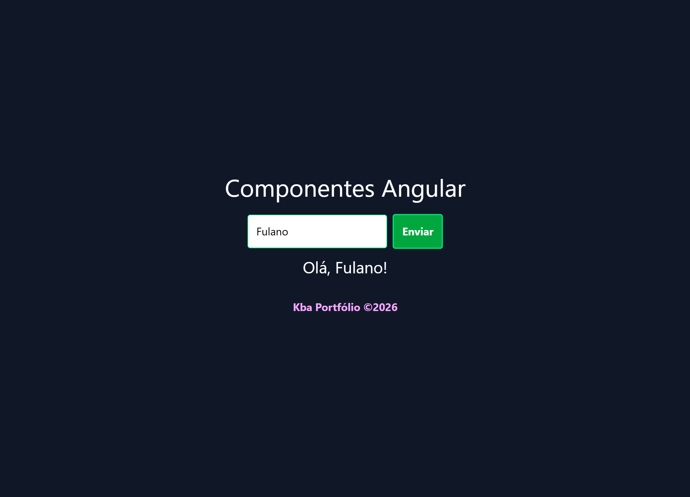

# Components Angular

## Objetivo

Desenvolver um formulário simples em Angular utilizando **FormsModule**, **Signals** e **data binding** para capturar e exibir dados do usuário. O projeto demonstra o uso de **condição ternária** na interface, **Tailwind CSS** para estilização, componentes reutilizáveis e eventos de formulário com **ngSubmit**.

## Tecnologias

* Angular
* TypeScript
* HTML5
* Tailwind CSS
* FormsModule
* Signals
* Data Binding
* Event Binding
* Interpolação
* Condição Ternária
* Componentes Standalone
* Componentização

## Configuração

#### Instalar dependências: ``npm install``
#### Start da aplicação: ``ng serve`` ou ``ng s``
#### Abrir no navegador: ``http://localhost:4200/``

## Contatos
- E-mail: [kba.2879@gmail.com](mailTo:kba.2879@gmail.com)
- Linkedin: [/katarine-albuquerque](https://www.linkedin.com/in/katarine-albuquerque/)
